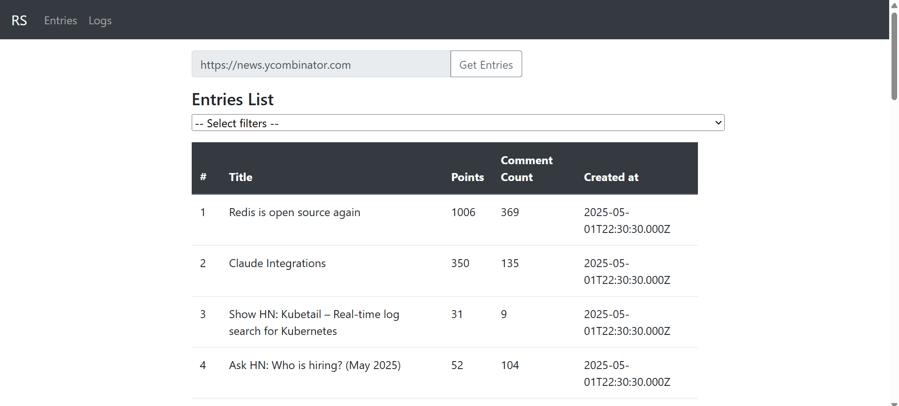
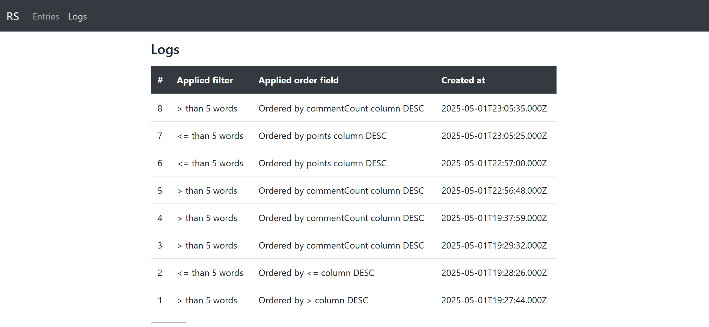

# Angular Demo App (Web Crawler) with Rest API

This app contains a list of entries gathered from a given website and a list of logs for applied filters




## Project setup
```
npm install
```

### Run
```
ng serve --port 4200
```

Run `ng serve --port 4200` for a dev server. Navigate to `http://localhost:4200/`. The app will automatically reload if you change any of the source files.

Back-end that works with this Front-end
> [Demo app backend](https://github.com/resparza95/demo-app-backend)